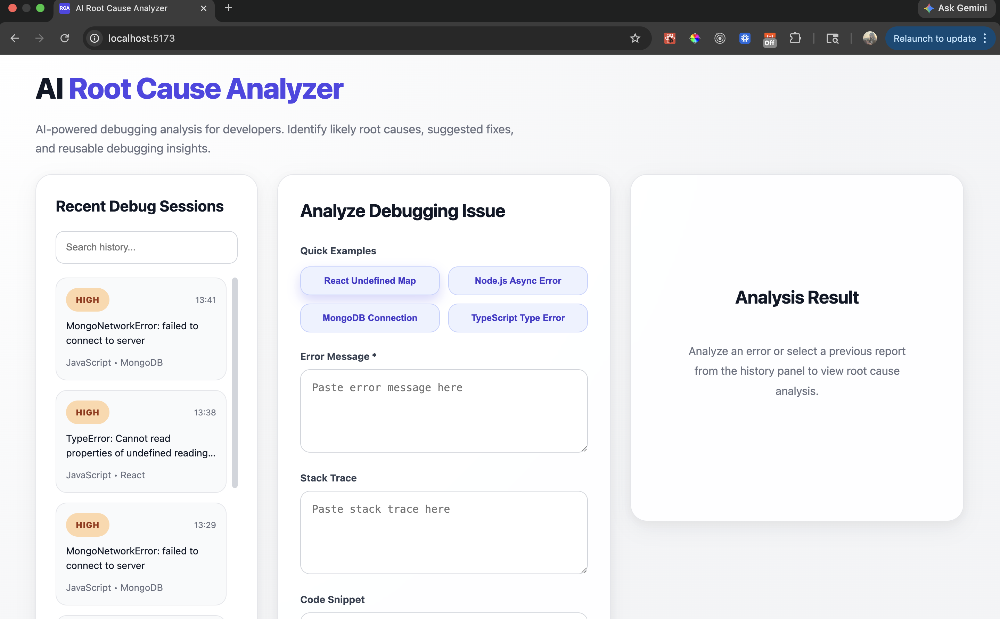
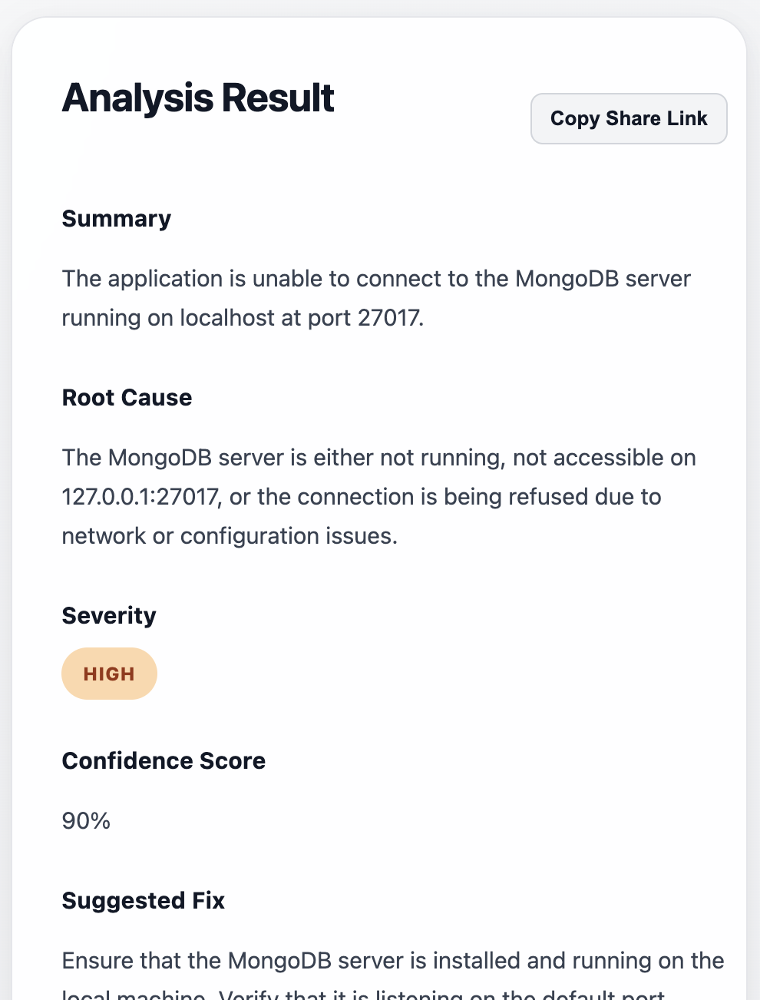
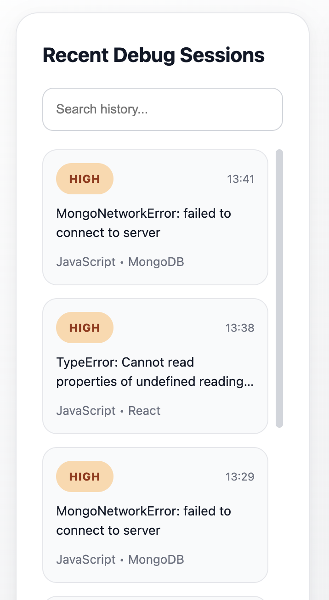

# AI Root Cause Analyzer

AI Root Cause Analyzer is an AI-powered developer tool built with **React, Node.js, TypeScript, OpenAI, PostgreSQL, and Prisma** that helps engineers investigate runtime errors through structured AI-generated root cause analysis, persistent debugging history, and shareable debugging reports.

The application helps developers analyze runtime errors, stack traces, and code snippets by generating structured root cause analysis, suggested fixes, improved code recommendations, severity classification, confidence scoring, and preventive guidance.

Unlike a simple stateless AI demo, the application persists every debugging session, enables report sharing, and allows developers to revisit previous analyses through a searchable debugging history.

---

## Why This Exists

Modern AI models can explain individual errors extremely well.

However, debugging is often more than understanding a single stack trace.

Developers frequently need to:

- Revisit previous investigations
- Track recurring issues
- Share debugging findings with teammates
- Maintain a history of root cause analyses
- Organize debugging knowledge over time

AI Root Cause Analyzer explores this workflow by combining AI-generated analysis with persistent storage, searchable history, and shareable debugging reports.

Instead of treating each debugging session as a one-off conversation, the application aims to make debugging insights reusable, discoverable, and easier to collaborate on.

The long-term vision is to evolve beyond isolated error analysis by incorporating code changes, repository context, logs, and debugging workflows to provide richer root cause investigation capabilities.

---

## Live Demo

**Application:**

https://root-cause-analyzer.vercel.app/

---

## Features

### AI-Powered Debug Analysis

- Analyze runtime errors
- Understand stack traces
- Review code snippets
- Generate root cause analysis
- Suggest possible fixes
- Recommend improved code
- Provide prevention tips
- Assign severity levels
- Return confidence scores

---

### Persistent Debug History

- Save every AI analysis
- PostgreSQL-backed storage
- Search previous sessions
- Reload historical reports
- Clickable debugging history
- Automatic history refresh

---

### Shareable Reports

- Dedicated report pages
- Route-based report retrieval
- Copy shareable report links
- Reopen reports directly from URLs
- Persistent report storage

---

### User Experience

- Modern responsive interface
- Built-in debugging examples
- Loading states
- Scrollable history panel
- Searchable history sidebar
- Interactive report retrieval
- Report sharing workflow

---

## Screenshots

### Home



---

### AI Analysis



---

### Persistent Debug History



---

## Architecture

```text
                   +------------------+
                   |      React       |
                   +---------+--------+
                             |
                             |
                   +---------v--------+
                   |   Express API    |
                   +---------+--------+
                             |
              +--------------+--------------+
              |                             |
              |                             |
    +---------v---------+       +-----------v-----------+
    |      OpenAI       |       |  PostgreSQL (Neon)   |
    +-------------------+       +-----------+-----------+
                                            |
                                  +---------v---------+
                                  |    Prisma ORM     |
                                  +-------------------+
```

---

## Tech Stack

### Frontend

- React
- TypeScript
- Vite
- Axios
- React Router

### Backend

- Node.js
- Express.js
- TypeScript

### AI

- OpenAI API

### Database

- PostgreSQL (Neon)
- Prisma ORM

### Validation

- Zod

### Deployment

- Railway (Backend)
- Vercel (Frontend)

---

## Project Structure

```text
ai-root-cause-analyzer/
│
├── backend/
│   ├── prisma/
│   └── src/
│
├── frontend/
│   └── src/
│
├── screenshots/
│
└── README.md
```

---

## API Endpoints

### Analyze Debugging Issue

```http
POST /api/debug/analyze
Analyzes an error message, stack trace, and code snippet using OpenAI.
```

---

### Mock Analysis

```http
POST /api/debug/mock-analyze
Returns mock analysis data for local development and UI testing.
```

---

### Fetch Debug History

```http
GET /api/debug/history
Returns recently analyzed debugging reports.
```

---

### Fetch Single Debug Report

```http
GET /api/debug/report/:id
Returns a specific saved debugging report.
```

---

## Example Request

```json
{
  "errorMessage": "TypeError: Cannot read properties of undefined reading map",
  "stackTrace": "at UserList.jsx:12",
  "codeSnippet": "const names = users.map(user => user.name);",
  "language": "JavaScript",
  "framework": "React"
}
```

---

## Local Setup

### Backend

```bash
cd backend
npm install
npm run dev
```

Runs on:

```text
http://localhost:5225
```

---

### Frontend

```bash
cd frontend
npm install
npm run dev
```

Runs on:

```text
http://localhost:5173
```

---

## Current Capabilities

- AI-assisted debugging
- Runtime error analysis
- Stack trace interpretation
- Code snippet analysis
- Root cause detection
- Suggested fixes
- Improved code recommendations

## Persistence

- PostgreSQL storage
- Prisma ORM integration
- Persistent debugging history
- Historical report retrieval

## Navigation

- Searchable debugging history
- Clickable history navigation
- Dedicated report routes
- Shareable report URLs

## Reporting

- Severity classification
- Confidence scoring
- Prevention tips
- Follow-up questions
- Shareable debugging reports

---

## Future Roadmap

### Version 1.1

- Export analysis (Markdown/PDF)
- Advanced filtering
- Pagination

### Version 2.0

- GitHub PR analysis
- Repository-aware debugging
- Log correlation
- Context-aware debugging workflows

### Long-term Vision

- AST/codebase analysis
- AI-assisted root cause tracing
- Production observability integration
- Developer workflow automation

---

## Motivation

Modern AI models can explain isolated errors, but effective debugging often requires preserving context, revisiting previous investigations, and sharing debugging insights across teams.

This project explores how AI can assist developer workflows by combining structured AI analysis, persistent debugging history, and shareable debugging reports into a unified developer experience.

---

## Author

**Saman Arshad**

Full Stack Engineer with 7+ years of experience building scalable web applications across JavaScript ecosystems, currently exploring AI-assisted developer tooling and intelligent debugging workflows.

---

## License

MIT
